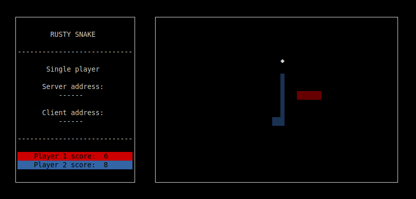

<!-- INFO -->
## About the Project


rusty_snake is a simple multiplayer snake-like game with terminal UI.

There are two game modes:
* You can play against computer
* You can play with other person in local network

### Built With
* [ncurses](http://www.gnu.org/software/ncurses/ncurses.html)

<!-- GETTING STARTED -->
## Getting Started

Follow these instructions to download, build, and run the game.

### Prerequisites

Download the [Rust](https://www.rust-lang.org/tools/install) installer. Run command in terminal (Debian/Ubuntu Linux) and follow the instructions. This program targets the latest stable version of Rust 1.43.1 or later.
```sh
curl --proto '=https' --tlsv1.2 -sSf https://sh.rustup.rs | sh
```

Install the ncurses library in Debian/Ubuntu Linux
```sh
sudo apt-get install libncurses5-dev libncursesw5-dev
```

### Installation

1. Clone the repository
```sh
git clone https://github.com/gradzik/rusty_snake.git
```
2. Enter project directory
```sh
cd rusty_snake
```
3. Build and run
```sh
cargo run
```
4. To run again
```sh
./target/debug/./rusty_snake
```

<!-- USAGE EXAMPLES -->
## Usage
### Controls

Use keyboard arrow keys to move snake.

| Key               | Description                                        |
| ----------------- | -------------------------------------------------- |
| <kbd>&larr;</kbd> | Move Left                                          |
| <kbd>&rarr;</kbd> | Move Right                                         |
| <kbd>&uarr;</kbd> | Move Up                                            |
| <kbd>&darr;</kbd> | Move Down                                          |
| <kbd>q</kbd>      | Quit game                                          |


##### Available commands

* **-h, --help** - Prints help information.
* **-s, --server** - Run as multiplayer game server.
* **-V, --version** - Prints version information.
* **-c, --conn <connect>** - Address of Snake server to connect.
* **-p, --port <port>** - Server port number.

##### Singleplayer game

By default, the game starts in a single player. That means you control one snake, and the second one is controlled by a computer. The algorithm isn't very smart and it doesn't care about collisions but you can try to play with it.


##### Multiplayer game

Before running the game in multiplayer mode make sure the port you want to use is open. To run in multiplayer mode use command-line arguments.

Creating game server:
```sh
./rusty_snake -s -p 10000
```

Connecting to existing game server use -a parameter with server ip address and port number.
```sh
./rusty_snake -c 192.168.0.1:10000
```

<!-- LICENSE -->
## License

Distributed under the [MIT license](LICENSE-MIT).

<!-- ACKNOWLEDGEMENTS -->
## Acknowledgements
* [ncurses-rs](https://github.com/jeaye/ncurses-rs)
* [rand](https://github.com/rust-random/rand)
* [clap](https://clap.rs)
* [serde](https://serde.rs)
* [bincode](https://github.com/servo/bincode)
* [lazy_static](https://github.com/rust-lang-nursery/lazy-static.rs)
* [maplit](https://github.com/bluss/maplit)
